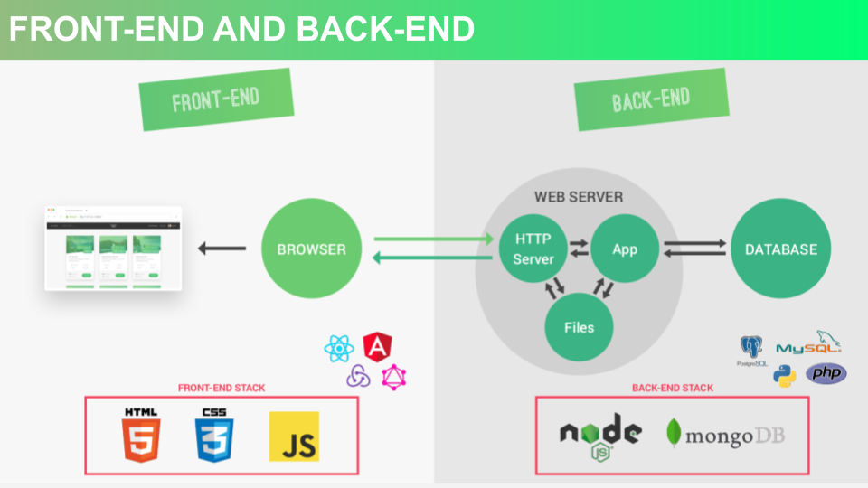
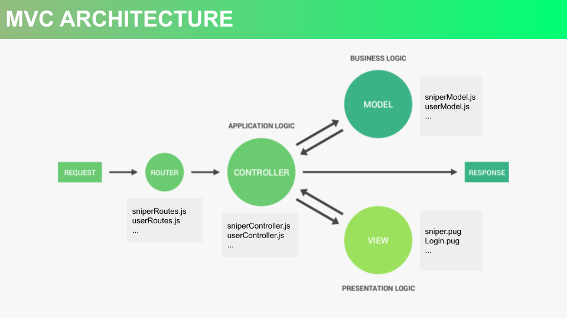
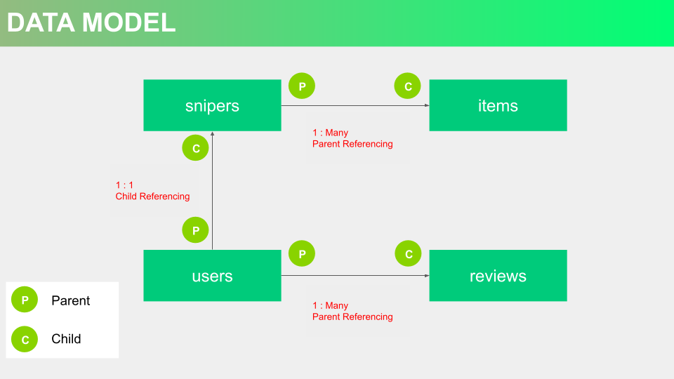
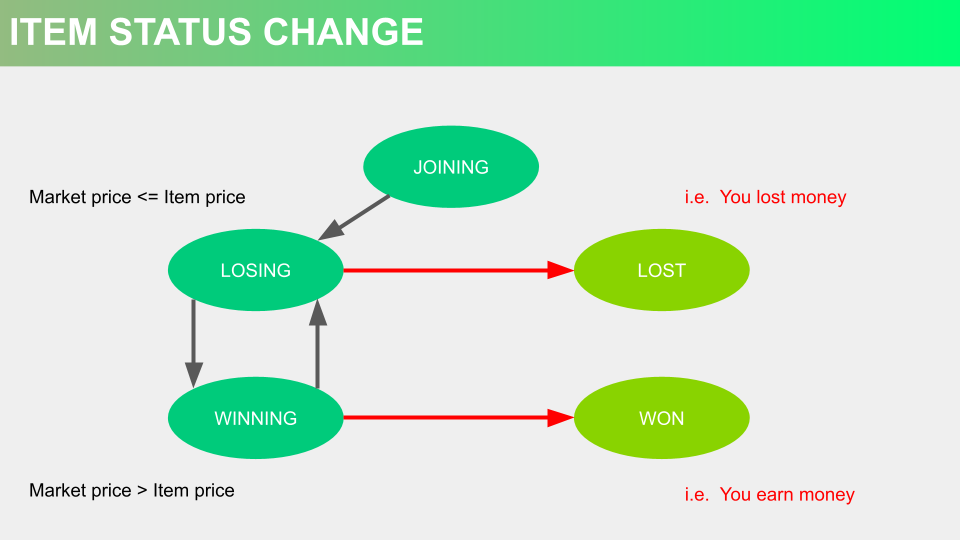
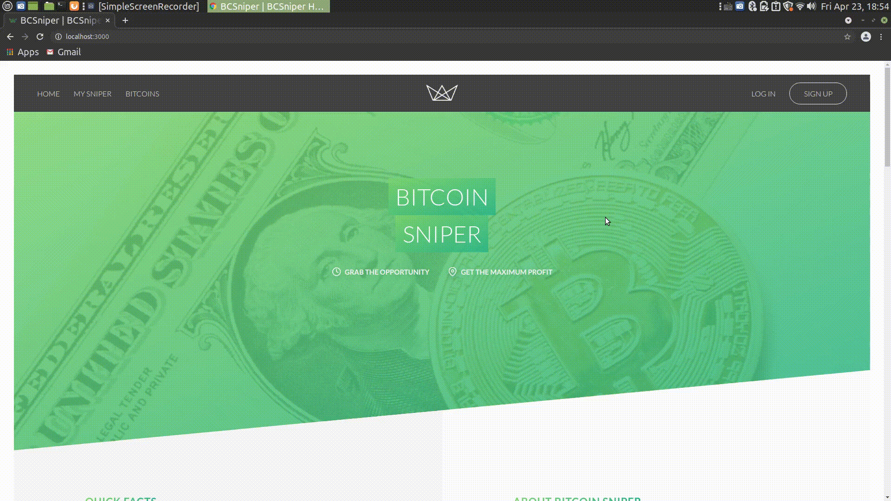

# Bitcoin Sniper 
비트코인 스나이퍼는 비트코인 경매를 자동으로 도와주는 데모 어플리케이션입니다. 비트코인은 외줄타기와 같습니다. 시세가 급등과 급락을 오가기 때문에, 한 발 헛 딪으면 바로 나락으로 떨어집니다. 비트코인 스나이퍼를 개발하게 된 배경은 여기에 있습니다. 즉, 비트코인 거래자에게 최소한의 안전장치로서 역할하도록 만들었습니다. 예를들어, 비트코인 스나이퍼는 비트코인 가격이 급락하여 더는 손쓸수 없기 전에 팔 수 있습니다. 

## 목차 (Table of Contents)

1. 테크 스킬
1. 어플리케이션 구조
1. 동작
1. 기능
1. 보완점
1. 마무리

## 1. 테크 스킬 (Tech Skills)
- NodeJs, ExpressJs, MongoDB, PugJs, HTML, CSS, JavaScript, Parcel

## 2. 어플리케이션 구조 (Architecture)
- 프론트엔드는 HTML CSS JavaScript 그리고 백엔드는 NodeJs MongoDB 를 사용했습니다. 

- 디자인 패턴은 MVC (Model, View, Controller) 를 사용했습니다. 

- 데이터 간의 관계는 3 가지입니다: 스나이퍼 - 아이템, 유저 - 스나이퍼, 유저 - 리뷰. 

- 아이템의 상태 변화는 5가지 입니다: 참여(JOINING), 손해 중 (LOSING),  이득 중 (WINNING),  손해(LOST) 이득(WON). 

## 3. 동작 (Flow)
- 회원가입 및 로그인 
- 아이템 만들기 
- 아이템 팔기 

## 4. 보완점 (Complements)
- 패스워드를 복잡하게 만들기
- 패스워드를 잊어버렸을 경우, 이메일로 토큰 보내기
- 비트코인을 원하는 양만큼 구매하기
- 아이템을 만든 후에 다시 설정하기
- 매 10분마다 주기적으로 아이템 업데이트하기
- End-to-End 테스트 만들기

## 5. 마무리 (Conclusion)